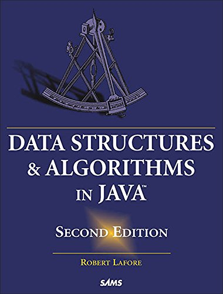

# "Data Structures and Algorithms in Java (2nd Edition)"
Solving exercises from the book "Data Structures and Algorithms in Java (2nd Edition)" by Robert Lafore (Author)

---
In this repository, the exercise numbers are in the order in which they appear in the 2013 Russian-language edition of the book.

ISBN 978-5-496-00740-5 (Russian) 
ISBN 978-0672324536 (English)

